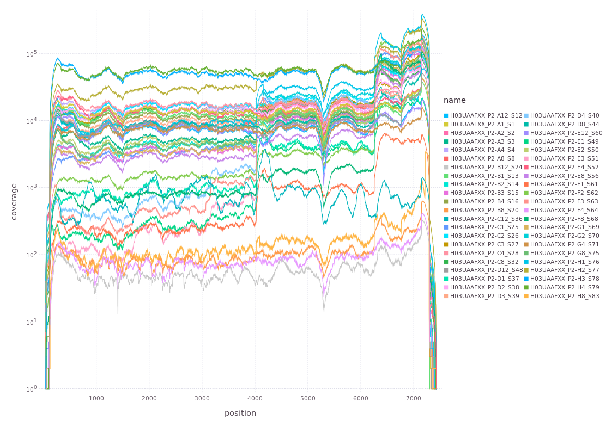
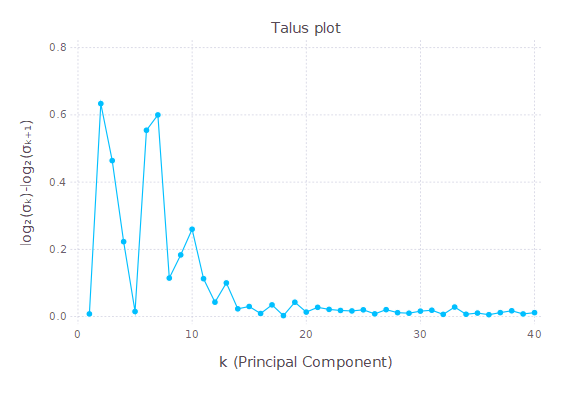
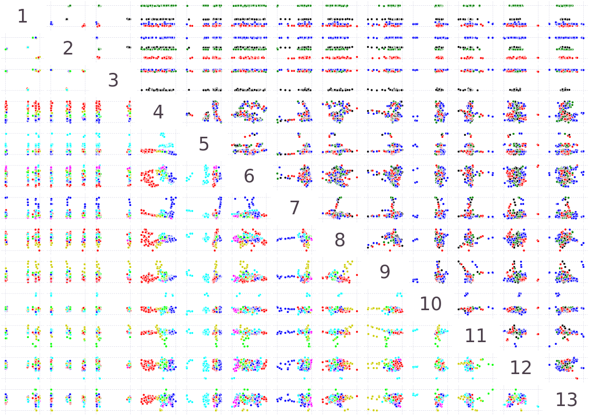
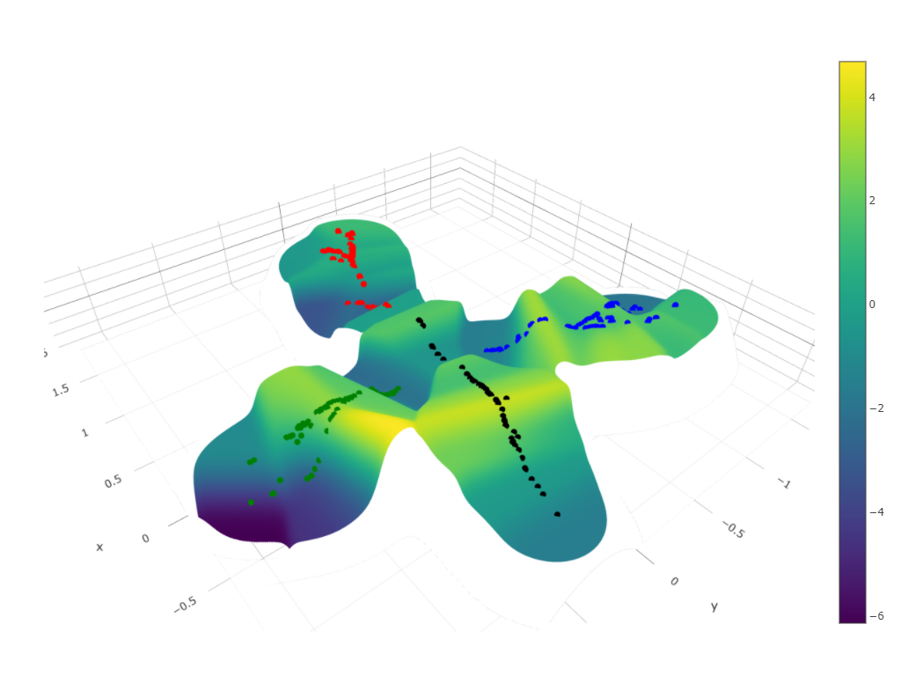

# DISSEQT.jl
The DISSEQT.jl package is an implementation of the pipeline described in the paper [DISSEQT – DIStribution based modeling of SEQuence Space Time dynamics](https://www.biorxiv.org/content/10.1101/327338v1).


# Installation
Start Julia (1.1 or later) and enter the Package REPL by pressing ]. Then install DISSEQT.jl by entering:
```
add https://github.com/rasmushenningsson/SynapseClient.jl.git
add https://github.com/rasmushenningsson/DISSEQT.jl.git
```
Also see installation instructions for [SynapseClient.jl](https://github.com/rasmushenningsson/SynapseClient.jl) if you want to enable the [Synapse](https://www.synapse.org) features in DISSEQT.


# Examples
The complete analysis of deep sequencing data from the [DISSEQT paper](https://www.biorxiv.org/content/10.1101/327338v1) is available in Synapse [here](https://www.synapse.org/#!Synapse:syn11639899). 
Note how the Provenance system in Synapse makes it possible to trace the steps used to produce every result in Synapse, showing how the analysis was done (which script was called) and listing all input files.
All example scripts below upload their results to Synapse. The scripts themselves are also automatically uploaded to ensure that all analyses can be rerun elsewhere. (In order to run the scripts locally, you need to make the Julia Packages used by the script avaiable by running e.g. `add JLD` in the Julia Package REPL.)
The steps in the DISSET pipeline are outlined below:

## Alignment
If you already have BAM files, you can start the DISSEQT pipeline from the next step. Note however that DISSEQT performs iterative alignment. That is, if the consensus sequence of an aligned mutant swarm is different from the reference sequence used during alignment, it is realigned using the new consensus sequence as the reference. The process is repeated until the reference does not change. Iterative alignment improves inference of codon frequencies close to consensus changes.

To run alignment locally, you need to have [bwa](https://github.com/lh3/bwa), [samtools](http://www.htslib.org) and [fastq-mcf](https://expressionanalysis.github.io/ea-utils/) installed and available in your path.

Example scripts and other relevant files for running alignment using DISSEQT can be found [here](https://www.synapse.org/#!Synapse:syn18694207). It is recommended to use one [script](https://www.synapse.org/#!Synapse:syn18695094) for each run. The [Reference Genomes](https://www.synapse.org/#!Synapse:syn18694208) and [Adapter](https://www.synapse.org/#!Synapse:syn18694218) files are also needed.

The outputs of the Alignment step are [BAM Files](https://www.synapse.org/#!Synapse:syn18694439), the consensus sequence and a detailed alignment log for each sample are also saved in the same folder.
An overview log file - [AlignUtils.log](https://www.synapse.org/#!Synapse:syn18695095) - is also created. 

An optional step for quality control is to create [Read Coverage graphs](https://www.synapse.org/#!Synapse:syn18728439) by running another [script](https://www.synapse.org/#!Synapse:syn18728454).


## Codon Frequency Inference
Codon frequencies are inferred from BAM Files. An example script can be found [here](https://www.synapse.org/#!Synapse:syn18697620).
The output is one [Mutant Swarm File](https://www.synapse.org/#!Synapse:syn18697618) per sample and an [overview log file](https://www.synapse.org/#!Synapse:syn18697621).

## Limit of Detection
DISSEQT determines the Limit of Detection for each codon at each site per experiment. To account for differences between runs, a [Metadata table](https://www.synapse.org/#!Synapse:syn11639906) with details about the samples is needed for this step. The Limit of Detection script for the Fitness Landscape data set can be found [here](https://www.synapse.org/#!Synapse:syn18700843).

## Dimension Estimation
A Talus Plot used for dimension estimation of the Fitness Landscape data set can be created using this [script](https://www.synapse.org/#!Synapse:syn18701723).


## Sequence Space Representation
One of the core features of the DISSEQT pipeline is to produce a low-dimensional representation of the Mutant Swarms in Sequence Space, which is useful for plotting and downstream analysis.
The script for the Fitness Landscape data set can be found [here](https://www.synapse.org/#!Synapse:syn18716280).
First, a high-dimensional representation is created using the inferred codon frequencies and estimated per-variant limits of detection. Second, [SubMatrix Selection SVD](https://github.com/rasmushenningsson/SubMatrixSelectionSVD.jl) is used for dimension reduction, based on the number of dimensions determined in the Talus Plot.


## Downstream Analysis
Based on the low-dimensional representatation, fitness landscapes and sequence space visualizations are created in this [script](https://www.synapse.org/#!Synapse:syn18774440). An evaluation of the ability of different models to predict fitness is performed in this [script](https://www.synapse.org/#!Synapse:syn18774322).


# Contact
If you have problems running DISSEQT, please open an issue in the Issue Tracker or contact rasmus.henningsson@med.lu.se.
